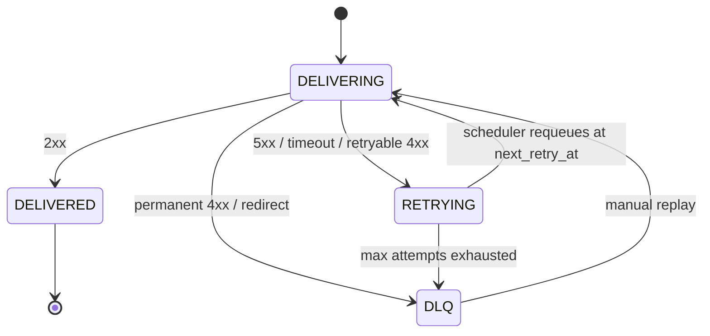
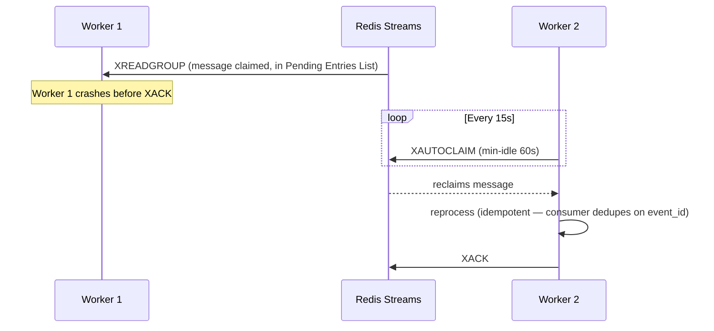

# EventMesh — Architecture Overview

## Components

- **API** (`apps/api`) — FastAPI service. Authenticates requests, validates
  input, persists events + outbox rows transactionally, serves read
  endpoints, exposes `/metrics`.
- **Worker** (`apps/worker`) — consumes `eventmesh:deliveries` via a Redis
  Streams consumer group, runs the delivery engine (HTTP send, sign,
  classify, circuit-break), and also runs the outbox publisher loop
  (see ADR-011).
- **Scheduler** (`apps/scheduler`) — requeues due retries
  (`deliveries.next_retry_at <= now`) and runs retention cleanup jobs.
- **Demo webhook** (`apps/demo-webhook`) — a controllable HTTP receiver
  for demos and failure testing.
- **PostgreSQL** — system of record: tenants, API keys, endpoints, events,
  deliveries, idempotency keys, outbox.
- **Redis** — Streams (queue), rate-limit counters, circuit-breaker read
  path is DB-backed (see ADR-009), worker heartbeats.

## Event lifecycle

```mermaid
sequenceDiagram
    participant P as Producer
    participant A as API
    participant DB as PostgreSQL
    participant R as Redis Streams
    participant W as Worker
    participant H as Webhook

    P->>A: POST /v1/events
    A->>DB: BEGIN; INSERT events; INSERT outbox_events; COMMIT
    A-->>P: 201 {event_id, status: queued}
    Note over A,DB: Response returns as soon as the DB commits.<br/>Redis is NOT on this critical path (ADR-005).

    loop Outbox publisher (inside worker, polls ~0.5s)
        W->>DB: SELECT ... FOR UPDATE SKIP LOCKED (PENDING outbox rows)
        W->>R: XADD eventmesh:deliveries
        W->>DB: UPDATE outbox_events SET status='published'
    end

    loop Worker consumer loop
        W->>R: XREADGROUP
        W->>DB: load event + subscribed endpoints
        W->>H: POST (signed, timestamped)
        H-->>W: 2xx / 4xx / 5xx / timeout
        W->>DB: INSERT deliveries row with outcome
        W->>R: XACK (only after DB commit)
    end
```

## Retry lifecycle



## Worker crash recovery



## Known limitations of this document

This overview describes the design as implemented through Phase 8 of the
PRD's phased plan. The React dashboard, full Grafana provisioning, and
load-test-derived performance figures are not yet built — see the top-level
README "Known Limitations" section for the authoritative list of what is
and is not done.
